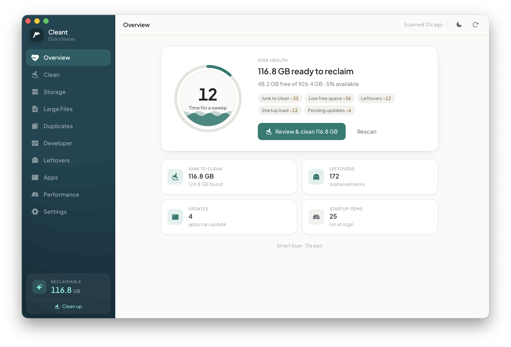

<div align="center">


# tclean

**A calm, lightweight macOS disk cleaner.**

Reclaim space from caches, logs, developer junk, leftovers, large/old files and
duplicates — you review everything, and nothing is removed without your go‑ahead.

[](LICENSE)


By **[Tunix Studio](https://github.com/tunix-studio)**

</div>

> [!WARNING]
> **Use at your own risk.** tclean removes files. It defaults to moving items to the
> **Trash** (reversible) and asks before removing anything, but you are responsible
> for what you choose to clear. The software is provided **“AS IS”, without warranty
> of any kind** (see [DISCLAIMER](DISCLAIMER.md) and [LICENSE](LICENSE)). Keep
> backups (e.g. Time Machine).

---

## Screenshots

<div align="center">



</div>

## Why tclean

Disk cleaners are usually loud, pushy, and a little scary. tclean is the opposite:
**quiet, transparent, and reversible.** It shows you exactly what it found and where
it lives, defaults to the Trash, and never touches anything you haven’t approved.
The name says it plainly — *clean*, done. Your Mac, lighter and kept that way. 🐬

## Features

| | |
| --- | --- |
| 🌊 **Smart Scan** | One pass over everything, summed up as an ocean‑themed disk‑health score with a factor breakdown. |
| 🧹 **Clean** | Caches, logs, developer junk, browser data, Trash — per‑category review, open the exact location in Finder. |
| 💾 **Storage** | A clear breakdown of what’s using your disk. |
| 🔍 **Large & old files** | Find big (50 MB+) and long‑forgotten files; sort by size or age. |
| 📑 **Duplicates** | Content‑hash duplicate finder; keep one, trash the rest. |
| 👩‍💻 **Developer** | Xcode DerivedData/DeviceSupport, simulators, npm/Gradle/CocoaPods/Homebrew & more. |
| 👻 **Leftovers** | Orphaned app support files & dead shell PATH entries. |
| 📦 **Apps** | Update via Homebrew, uninstall with leftovers, measure per‑app footprint. |
| ⚡ **Performance** | Login/startup items and an internet speed test. |
| ⏰ **Reminders** | A gentle schedule, with optional automatic cleaning of safe caches. |
| 🕓 **History & rules** | Cleanup history and exclusion rules (paths tclean will never touch). |

## Safety model

- **Move to Trash by default** — fully reversible; permanent deletion is opt‑in per run.
- **Always confirms** before removing anything.
- **Path guards** — removal is confined to `$HOME` (plus `/Applications` for uninstall),
  only direct children of validated roots, canonical‑parent checks, never follows
  symlinks, never touches `/System`. Downloads are only ever moved to the Trash.
- **Exclusion rules** — mark paths as off‑limits; enforced in the native (Rust) layer.

## Install

Download the latest signed, notarized `.dmg` from the
[**Releases**](../../releases) page. tclean is **distributed directly** with an Apple
Developer ID — it is **not** on the Mac App Store, whose sandbox forbids the broad
filesystem access a disk cleaner needs (the same reason tools like CleanMyMac and
DaisyDisk ship directly).

## Build from source

Requirements: **macOS**, **Rust** (stable), **Node ≥ 20.12**, Xcode command‑line
tools, and a package manager (pnpm recommended).

```bash
pnpm install
pnpm tauri dev      # run the app in development (compiles Rust on first launch)
pnpm tauri build    # produce a release .app / .dmg
```

Frontend‑only helpers (`pnpm dev`, `pnpm build`) render the UI with mock data in a
plain browser — handy for design work without the native shell.

> Toolchain note: this repo pins **Vite 6** + `@vitejs/plugin-react 4` for Node 20.12
> compatibility. On Node 22 LTS you can bump to the latest Vite.

## Tech

Tauri 2 (Rust) · React 19 · TypeScript · Tailwind v4 · Phosphor Icons. Design follows
a “Quiet Premium” system: warm monochrome with a single teal accent, flat surfaces,
1px hairlines, light by default with a dark theme.

## Contributing

Issues and PRs welcome. By contributing you agree your contributions are licensed
under Apache‑2.0. See [SECURITY.md](SECURITY.md) to report vulnerabilities.

## License

Copyright 2026 **Tunix Studio**. Licensed under the
[Apache License, Version 2.0](LICENSE).
